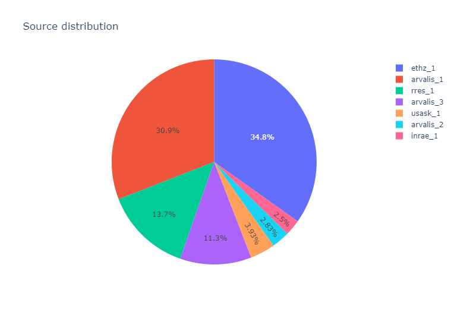
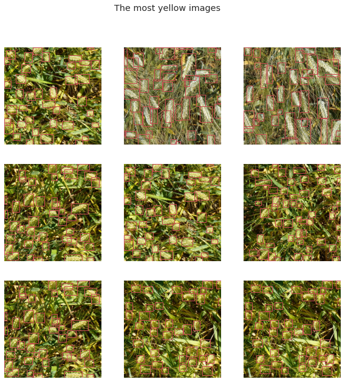

# Wheatheads-Detection
## To identify wheat heads using image analysis
--- You are attempting to predict bounding boxes around each wheat head in images that have them. If there are no wheat heads, you must predict no bounding boxes.

**Author** : SHAILESH DHAMA

To get large and accurate data about wheat fields worldwide, plant scientists use image detection of "wheat heads"—spikes atop the plant containing grain. These images are used to estimate the density and size of wheat heads in different varieties. Farmers can use the data to assess health and maturity when making management decisions in their fields.
However, accurate wheat head detection in outdoor field images can be visually challenging. There is often overlap of dense wheat plants, and the wind can blur the photographs. Both make it difficult to identify single heads. Additionally, appearances vary due to maturity, color, genotype, and head orientation. Finally, because wheat is grown worldwide, different varieties, planting densities, patterns, and field conditions must be considered. Models developed for wheat phenotyping need to generalize between different growing environments.
    
### Dataset:

Detection of wheat heads is an important task allowing to estimate pertinent traits including head population density and head characteristics such as sanitary state, size, maturity stage and the presence of awns. Several studies developed methods for wheat head detection from high-resolution RGB imagery. They are based on computer vision and machine learning and are generally calibrated and validated on limited datasets. However, variability in observational conditions, genotypic differences, development stages, head orientation represents a challenge in computer vision. Further, possible blurring due to motion or wind and overlap between heads for dense populations make this task even more complex. Through a joint international collaborative effort, we have built a large, diverse and well-labelled dataset, the Global Wheat Head detection (GWHD) dataset. It contains 4,700 high-resolution RGB images and 190,000 labelled wheat heads collected from several countries around the world at different growth stages with a wide range of genotypes.

1.Files:
      train.csv - the training data
      sample_submission.csv - a sample submission file in the correct format
      train.zip - training images
      test.zip - test images
2.Columns:
      image_id - the unique image ID
      width, height - the width and height of the images
      bbox - a bounding box, formatted as a Python-style list of [xmin, ymin, width, height], etc.
    
## Methods:

    ### 1.Analytic Approach :

       Wheat Detection should be bought under 2 classes: Whetheads and No_Wheatheads

    ### 2.Data Requirements :

        Structured Data containing image_id,width, height,bbox.

    ### 3.Data Collection :

        Dataset obtained from https://arxiv.org/abs/2005.02162

    ### 4.Wheatheads Analysis and Data Augmentations:

        Obtain Bounding Boxes using CV and Visualise,Transform using Bokeh,Albumentations.
        
## RESULTS :

#### Source Distribution


#### Small Spikes


#### Large Spikes


#### Large %age Bbox Area


#### Small %age Bbox Area


#### Darkest Images


#### Brightest Images


#### Most-Green Images


#### Most-Yellow Images


#### Augmented Image Transforms


### For further information
Please review the narrative of our analysis in [our jupyter notebook](./global-wheat-detection-eda.ipynb)

For any additional questions, please contact **shaileshettyd@gmail.com)

##### Repository Structure:

```

├── README.md                                               <- The top-level README for reviewers of this project.
├── global-wheat-detection-eda.ipynb                        <- narrative documentation of analysis in jupyter notebook
└── images                                                  <- both sourced externally and generated from code

```
## Citing

```
@misc{Shailesh:2020,
  Author = {Shailesh Dhama},
  Title = {Wheatheads-Detection},
  Year = {2020},
  Publisher = {GitHub},
  Journal = {GitHub repository},
  Howpublished = {\url{https://https://github.com/ShaileshDhama/Wheatheads-Detection}}
}
```
